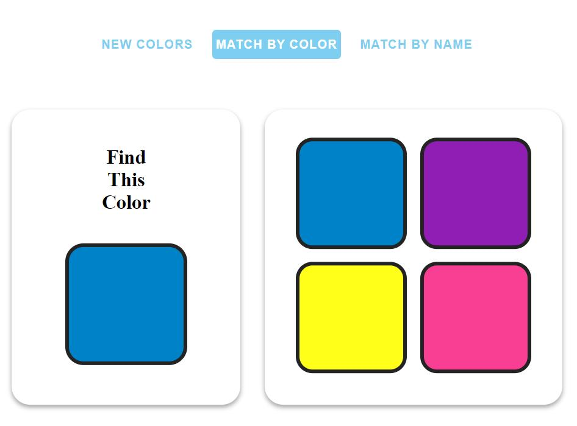

# The Color Matching Game

A simple point and click color matching game for young children written in Javascript.

## Usage

Copy this entire folder on a web server and browse to `colorGame.html`  
\- or -  
Simply open the `colorGame.html ` file in your local browser.

## License

This project including but not limited to any written code and sound bytes is shared with the explicit purpose of education and personal use. This project shall not be used in or in tandem with any commerical product offered to the general public with exception to From ABCs to ACTs, which reserves all rights.
